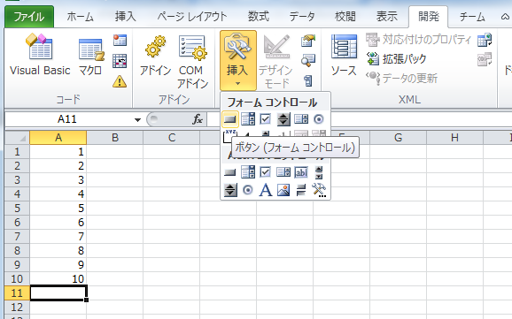
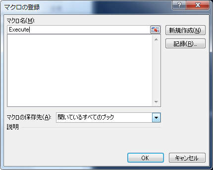
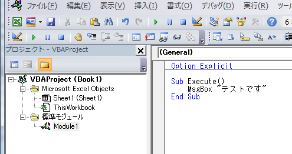
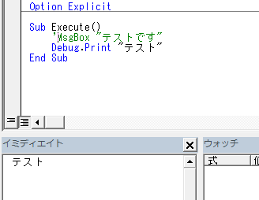
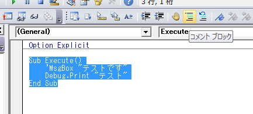

# VBAの基本
VBAで1つプログラムを作成してから実行するまでの流れをまとめます。([はじめに](intro)の環境設定は行っておいてください。)

例) A1～A10に1～10までの数字が入力されている。VBAを実行するボタンを押すとその合計値をC1に出力するとします。

## 1. マクロ関数(Sub)の作成とはじめての実行
マクロを実行するボタンをシートに配置します。
「開発」タブ＞「コントロールの挿入」＞左上のボタン
をクリックするとカーソルが矢印から十字になります。ドラッグして長方形を作るとボタンが作成されます。



「マクロの登録」というウィンドウが表示しマクロ関数(Sub)を指定もしくは新規登録することができます。
今回は、1つ目のマクロであることとわかりやすさからマクロ名を 「ボタン1_Click」から「Execute」に変更し「新規作成」を押します。
(executeは実行するという意味の英単語です。マクロ名は先頭は大文字で残りを小文字としてください)



つぎにコードを入力するウィンドウが表示されます。これを「Visual Basic エディタ 」(VBE)とよびます。
先程新規作成したExecuteというマクロ(Sub)がコード入力に表示されています。
左記のボタンをクリックすると、SubからEnd Subまでの間に記載したプログラムが実行されます。

### 最初のプログラムの入力
動作確認を兼ねてSubとEnd Subの間に以下のプログラムを入力してください。

```vb
Option Explicit

Sub Execute()
    MsgBox "テストです" 
End Sub
```

※ プログラムで定義されている文字列(Sub、 MsgBox、Endなど)は全て小文字で入力しても行を移動した時に自動的に修正されます。



上のツールバーにある再生ボタン(緑色の矢印)もしくは キーボードのF5を押すとこのプログラムが実行されます。
今回は、「テストです」と表示されるメッセージボックスが表示します。OKを押すと終了します。
メッセージボックスが表示されないときはどこかにエラーがあります。プログラムの文字が赤くなっていたらタイプミスなどが考えれられます。


次に プログラムを次のように修正し再生(F5)を行ってください。
このときVBエディタ下のイミディエイトウィンドウにDebug.Printで指定した文字列「テスト」が表示されます。

```vb
Option Explicit

Sub Execute()
    'MsgBox "テストです"
    Debug.Print "テスト"
End Sub
```



Excelに戻ってボタンに表示する文字や大きさ、位置を変更することができます。

* ボタンの周囲に白い四角(□)が表示されていないときは右クリックすると編集モードとなります。 
* 編集モードのときに文字をクリックすると変更でき、フォントや文字の大きさ、位置、ボタンの色なども変更できます。
* 変更が終わったらなにもないところをクリックすると白い四角が消えてボタンとして押せるようになります。
  (今回はボタンの文字を「実行」とし、大きさを文字がちょうどよく表示される大きさにします。) 

### コメントについて
シングルクオート(' : Shift + 数字の7)を入力するとそれ以降はコメント扱いとなりプログラムとして処理されません。
適宜プログラムの補助的な説明をコメント行として記載ください。

また複数行まとめてコメントアウトしたいときは、該当の行を選択してツールバーの「コメントブロック」をおすと行の先頭にシングルクオートがつきます。
コメントアウトをもとに戻したいときは右の「非コメントブロック」を押すとシングルクオートが除外されます。



### まとめ) 1でしたこと

* ボタンの作成、調整
* マクロ関数(Sub)の作成
* MsgBox, Debug.Printによる文字の出力
* プログラムの実行
* コメント


---------------------------------

## 2. セルの値の取得して計算
ここではシートのA1～A10の値を順番に足して C1に出力するプログラムを検討します。
先程のDebug.Print 行以下に記入ください

合計値を保存する変数を定義します。

```vb
Dim total As Long
```
totalは初期値0の整数(32bit 最大値は約20億)の変数が定義されます。

```vb
Dim i As Long
For i = 1 To 10
    total = total + Cells(i, 1).Value  ' i行 1列(=A列)の値を順に足す
Next
```
For～Nextはその間の処理を繰り返します。このときiが1から10まで1つずつ増えていきます。
1つのセルの値は Cells(行番号,列番号).Value として取得することができます。

```vb
Cells(3, 1).Value = total
```
3行1列目のセル(=C1)に 合計値を記入します。

* これで再生ボタンを押するとエラーがなければ C1セルに 55 という値が設定されます。
* C1を一旦削除してから実行ボタンを押しても計算できることを確認してください。

マクロを含めたExcelを保存します。ファイル> 名前をつけて保存 から ファイルの種類を「マクロ有効ブック」として 拡張子をxlsmとして保存してください。

### まとめ) 2でしたこと

* 変数の定義
* 値の取得と代入、繰り返し処理
* マクロ有効ブックとして保存

--------------------------------------------

## もう少し詳しく

### 変数の定義

VBAでよく使う変数の定義(型)を以下にまとめます。

|型        | 説明            | 備考                  | 
|----------|-----------------|-----------------------|
|Long      |整数             |-20億~+20億            |
|Double    |倍精度浮動小数点数|                       |
|String    |文字列           |                       |
|Date      |日付             |                       |
|Boolean   |論理値           | True もしくはFalse       |
|Variant   |ヴァリアント         | どれでも入れられる型      | 
|Object    |オブジェクト         | 上記以外               |
|Worksheet |Excelシート        | Objectの子クラス         |
|Range     |Excelセル         | Objectの子クラス         |

* Integer という16bit(-32768~32767)の範囲の整数を利用することもできます。
* 「Objectの子クラス」はObject型の変数に代入することができます。シートやセルについては次の項目を見てください。

```vb
入力例
Dim i As Long: i = 100    ' 整数のi に100を入力

Dim x as Double: x = 3.14

Dim s as String: s = "ABC"

Dim d as Date: d = #2017/1/4#  '日付をプログラムで設定するとき
Dim d2 as Date: d = #2017/1/4 12:14#  '時刻も含められる

Dim b as Boolean: b = True

Dim val   ' As～を省略するとvariant型になります。(必要なときのみ利用)

Dim dic As Object: Set dic = Create("Scripting.Dictionary")
' オブジェクトに値を設定するときは

```

* 途中に: を入れると複数の文を1行に記入することができます。

-----------------------------------------

### Excelセルやシートの操作
Excelのセルの値を取得、変更するときは、指定方法によってRange, Cellsの2通りがあります。
A1や A1:A10 など通常のExcelで指定するときは Range、 行・列番号で指定するときはCellsを利用します。

```vb
Dim r As Range  '1つもしくは複数のセルを入れる変数はRangeとして定義します
Set r = Range("A2")
Set r = Cells(2, 1)  ' A2 = 2行1列目として定義 

' 複数セルを指定する場合
Set r = Range("A2:E2") 
Set r = Range(Cells(2, 1), Cells(2, 5))  '数値で指定する場合

' rに指定したそれぞれのセルの値を参照、代入する
Dim c As Range
For Each c In r
   Debug.Print c.Value
   
   ' 行番号、列番号、Excelのセル名($A$2など)を出力
   Debug.Print c.Row, c.Column, c.Address  

   c.Value = "ABC"  ' このセルに値を挿入
   c.Formula = "=1+2"  '計算式を入れる場合  他の例) =sum(A1:A10)
   c.Font.Color = RGB(0,0,255) '文字の色(赤、青、緑)
   c.Interior.Color = RGB(0,0,0)    ’背景の色
Next

' セルの値を削除する時
Range("A1:A10").ClearContents   '指定した範囲のセルの値を削除

```

* 文字や背景の色の指定については次の項目を見てください。

RangeやCellsは今表示しているシートのセルを参照します。
別シートのセルを操作したいときはシートを指定してください。

```vb
Dim ws As Worksheet: Set ws = Worksheets("Sheet1")  
Dim r As Range
Set r = ws.Range("A2")
Debug.Print r.Value ' Sheet1シートのA2の値を出力

' WithとEnd Withに挟まれたRangeやCellsで 
' .(ピリオド)から始まるものは Sheet1のものとなります
Dim r As Range
With Worksheets("Sheet1")
	Debug.Print .Range("A2").Value  ' Sheet1のセル
	Debug.Print Range("A2").Value   ' 今開いているシートのセル
End With
```

セルを指定する例を幾つか紹介します。

```vb
Cells.ClearContents   ' シートの全セルの値を削除

Range("A1,C1").Value = "hoge"  ' 離れた複数のセルに値を代入

Range("A1:A10,C1:C10").Formula = "=Today()"

Debug.Print Range("A1").Text   ' Excelにフォーマットされた表示されたものを文字列として取得
```


-----------------------------------------

### 色について
セルの文字や背景の色を取得・変更することができます。

```vb
Dim r As Range
Set r = Range("A1")

r.Font.Color = RGB(0,0,0) '黒
r.Font.ColorIndex = 3  '赤

r.Interior.Color = RGB(255,0,255) ' 紫
r.Interior.ColorIndex = 41 '青

' デフォルトにする
r.Font.ColorIndex = xlNone  
r.Interior.ColorIndex = xlNone  

' 他のセルの背景色をコピー
r.Interior.Color = Range("B1").Interior.Color

' 文字の色と背景を両方変更する
With Range("A1:A10")
    .Font.Color = RGB(0, 255, 0) ' 緑
    .Interior.Color = RGB(255, 255, 0) ' 黄色
End With
```

ColorIndexや RGBの数字によってどのような色となるかは以下を参考にください
<http://officetanaka.net/excel/vba/cell/cell04.htm>


