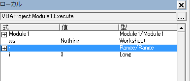

[TOP](.)

# VBAのデバッグ
プログラムを正しく動作できるように、エラーへの対処や処理が正しく実行できているかをプログラムを動かしながら確認することができます。
そのような作業を「デバッグ」といいます。

プログラム中に文字が赤くなっている行があると必ず実行時にエラーとなりますので解消ください。

## よくあるエラーと対処法
プログラムを実行するときに表示されるエラーメッセージとその対応策についてまとめます。
実行してエラーが起きたら OKぼたんもしくは デバッグボタンを押すと、最初に解釈できない行が黄色もしくは青で選択されます。

### コンパイルエラー：Sub またはFunctionが定義されていません。
そのプログラム内に未定義の関数があります。
スペルミスが考えられますので丁寧に探して修正ください。
F5でプログラムは再開するのでエラーが出なくなれば、改めて最初から実行確認してください。

### コンパイルエラー：構文エラー
構文エラーがあると、文字列が赤く表示されています。
そのまま実行しようとするとこの構文エラーが発生します。

### コンパイルエラー：Forに対するNextがありません。   など
Next や End XXX  など 処理のまとまりがきちんと囲まれていない状態ですので確認ください。


### コンパイルエラー：変数が定義されていません。
そのプログラム内に未定義の変数があります。OKすると該当箇所が選択されています。
Dimで定義していないか、スペルミスが考えられますので修正ください。

### 実行時エラー 438: オブジェクトは、このプロパティまたはメソッドをサポートしていません。
「デバッグ」ボタンを押すとエラーとなる行が黄色に表示されます。カッコのあとの文字列にスペルミス等があると考えられます。

### 実行時エラー 91 : オブジェクト変数またはWithブロック変数が設定されていません。
オブジェクト型の変数にSetを使わずに代入しています。 Set 変数名 = ～  という書き方にしてください。

## コンパイルエラー: 同じ適用範囲内で宣言が重複しています。
1つの関数内で名前の同じ変数が2回以上定義(Dim)されています。 
OKをおすと2回目に定義されている箇所が選択されるのでその行を修正ください。


-----------------------

## 動的デバッグの方法
プログラムは動作するも結果が期待するものとならない時、
プログラムを途中まで動かしながら保存されている変数の値を確認しつつ問題解決を図る動的なデバッグ実行をする方法を説明します。

基本的な流れ： ブレイクの設定 → ステップ実行 → 変数の値の確認

### ブレイク
変数の状況を確認したい最初の箇所を指定します。これを「ブレイク」と言います。
該当する行の左をクリックすると 濃い赤の丸印がつきます(もう一回クリックすると削除できます)

プログラムを実行するとその場所でプログラムが停止します(エラーのときも停止します)。


停止するまでに定義された変数はローカルウィンドウから確認することができます。



※ 値の部分をダブルクリックすると変更することも可能です。

セルの値などウォッチウィンドウから値を確認するのが難しいものは、イミディエイトウィンドウにDebug.Printを利用して出力することもできます。

```
Debug.Print r(1).Value
  30
Debug.Print r(1).Row, r(1).Column
  1           1

```

### 順次実行
デバッグをするときは1行ずつもしくはある部分単位で実行して値の変化を確認しつつ進めてください。

* 「ステップイン」(F8キー) : 1行ずつ実行します。停止した状態からプログラムを1行ずつ実行して変化を確認することができます。行が関数の場合はその中の処理も1行ずつ実行します。
* 「ステップオーバー」(Shift + F8キー) : 関数をまとめて実行させたいとき
* 「継続(緑三角の再生ボタン)」 (F5キー) : 次のエラーもしくは次のブレイクとなるまで実行します。
*「リセット(四角ボタン)」 : プログラムの実行を終了させます。

※ プログラムがデバッグ停止中でもコードを変更することができます。


### 参考
「自宅でプログラミング！」というまとめサイトの「デバッグとは?」の説明
http://www.239-programing.com/excel-vba/basic/basic021.html

「Excel VBA入門講座」 ウォッチウィンドウ
http://excelvba.pc-users.net/fol8/8_3.html
※ 変数の値をローカルウィンドウ以外で確認する方法です

-----------------------

## イミディエイトウィンドウへのログ出力

プログラム作成時に進捗状況や変数の値を確認するためDebug.Printを利用して文字を出力します。このウィンドウは最大199行までです。
また、ブレイク中にデバッグウィンドウにプログラムを入力することができます。

例) ブレイクで止まっている状態で 既に定義されている a(=4), b(=6)の変数の合計値を知りたい時

```
Debug.Print a + b
   10
```

