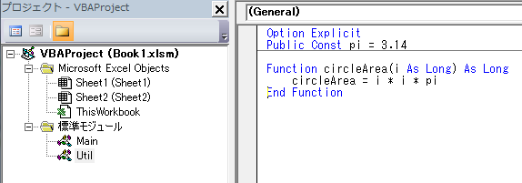

# プログラムが大きくなってきたら・再利用について
1つのマクロ関数(Sub) で記入しているとプログラムが長くなり見通しが悪くなります。
このときバグを入れ込んだり、テストをするのが大変となるのでFunction関数や複数の標準モジュールを利用して見通し良いプログラムを作成することができます。


## Function関数
Function関数は一定の処理をひとまとめにしたプログラムです。
長いプログラムを複数の関数に分けて見通しをよくしたり、一定の処理を何回も実行するときに有効です。

```vb
' 例 円の面積を計算
Sub Execute()
    Dim i As Long: i = 10
    Debug.Print i * i * 3.14 & "[cm2]"
End Sub
```

↓

```vb
Sub Execute()
    Dim i As Long: i = 10
    Debug.Print circleArea(i) & "[cm2]"
End Sub

' 円の面積を計算するFunction関数
Function circleArea(i As Long) As Long  
    Const PI = 3.14
    circleArea = i * i * PI
End Function
```

### Sub関数との違い

* 関数を抜けるときに値を返すことができます。値を返すときは関数名に対して代入してください
* マクロを実行する関数として指定することはできません

### 応用

後ろの引数は省略することができます。省略したときは =の後の値が設定されます。

```vb
Function test1(arg1 As Long, Optional arg2 As Long = 5)
    test1 = arg1 * arg2
End Function
```

引数の値は通常は変更できませんが、以下の記述で変更することができます

```vb
Function createString(ByRef str As String)
    str = "コメント"
End Sub

createString(s) として呼び出すと sに"コメント"という文字列が代入されます。
```

----------------------------

## 複数の標準モジュール挿入
ある関数を別の標準モジュール(ファイルのようなもの)に分離させることでプログラムの大事な部分を見やすくなります。

標準モジュールの追加方法: ツールバーの挿入> 標準モジュール

上記の円の面積の計算する関数を Utilモジュールに移動させます

```vb
' Mainモジュールにて
Sub Execute()
    Dim i As Long: i = 10
    Debug.Print circleArea(i) & "[cm2]"
End Sub

’ Utilモジュールにて
Function circleArea(i As Long) As Long  
    Const PI = 3.14
    circleArea = i * i * PI
End Function
```



### 応用
ある関数がその関数の書かれているモジュール内でのみ呼び出せるようにしたいときは関数の前にPrivateを追加してください

```vb
Private Function circleArea(i As Long) As Long  
    Const PI = 3.14
    circleArea = i * i * PI
End Function
```

また定数(Const)や変数(Dim)をどこかのモジュールにて集める方法がよく取られます。これらは同じモジュール内でしか参照できないので他から参照させたいときはPublicをつけてください

```vb
Public Const PI = 3.14
Public Dim dic As Object
```
	

