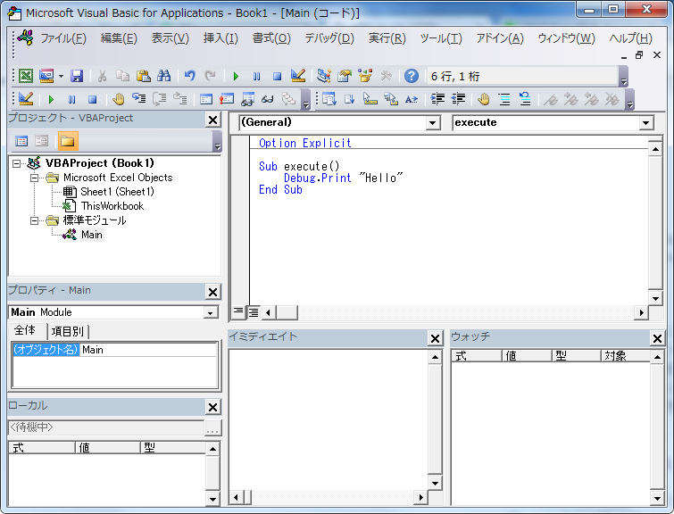

# はじめに
Excel VBA(Visual Basic for Application)は、
一定の操作手順を自動化するためにつかうツールです。
Visual Basic準拠のプログラミング言語で記述します。

## 主な用途
* 一定の手順だが、普通にExcelの計算式ですると長い作業となるとき
* 操作によっては、オペミスを招きそうなとき
* データサイズが巨大な場合 (数十MBを超える)
* 複数のExcelやCSVファイルなどをもとに集計するとき
* セルの修正に合わせて色やグラフを自動で調整したい

------------------

## VBAを利用する流れ
マクロ(操作内容を記録して繰り返し同じ処理を行う方法)は、作るのは簡単ですが応用しにくいので今回は対象外とします。

1. 事前準備
   1. どのような情報を集計・分析したいか(=出力内容)を考える。
   2. 入力に使えるデータやファイルを集める。
   3. 出力結果をレイアウトする (どういう表やグラフを利用するか、色などをつけるなど)
2. VBAの作成 (こまめにバックアップをとっておくこと) 
   1. 雛形(後述)を作成する
   2. VBAプログラムを作成。実行とデバッグを繰り返す
   3. 完成したら整形 (あとから修正しやすいように)

VBAプログラムはボタンを押した時もしくは セルの値が変更されたときに実行を開始する利用が一般的です。

------------------

## よく使うショートカット

### Excelにて
Alt + F11 : VBエディタを開く (開発タブの「Visual Basic」ボタン)
Alt + F8 : 実行するマクロ(Sub関数)を選択 (開発タブの「マクロ」ボタン)
Ctrl + Break : マクロの中断

### VBエディタにて
Ctrl + Space : 入力候補の表示
行を選択して tab : 右にインデント
行を選択して shift + tab : 左にインデント 

Shift + F2 : カーソルのある場所の関数や変数宣言箇所にジャンプ
Ctrl + Shift + F2 : ジャンプ元にカーソルを戻す

F5 : カーソルのあるマクロ(Sub関数)の実行・再開、もしくは実行するSub関数の選択

(ブレイク中のとき)
shift + F8 : ステップオーバ (その行のみ実行)
F8 : ステップイン (関数の中も含め1行ずつ実行)
F5 : 残りを全て実行 (もしくは次のブレークポイントまで実行)

------------------

### 初期設定
VBエディタを初めて使うときは以下の設定に変更下さい。

* ツール>オプション
  * 編集タブ
    * 「自動構文チェック」のチェックを外す
    * 「変数の宣言を強制する」以下にチェックを入れる
* 表示>ツールバー> にて デバッグ、標準、編集の3つをチェック (それぞれのツールバーが表示されるので上にドッキングしてください)
* 画面は左側に「プロジェクト」「プロパティ」「ローカル」と並べ、下は ローカルの右に「イミディエイト」「ウォッチ」と並べるのを標準的なものとします。
  表示がない場合は ツールバーの表示から選択してレイアウトしてください
  

