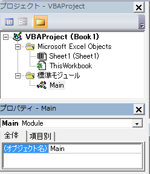

[TOP](.)

# その他の基本

## その他
VBAの利用で知っておいたほうがよい基本的なことをまとめます。
プログラムを動かしながらデバッグする方法は [デバッグ](debug) を見てください。

### 未定義の変数があるとき必ずエラーにする
各プログラムの先頭に「Option Explict」を必ず記入してください。
これにより未定義の変数があるとプログラムエラーとなり、タイプミスを軽減することができます。

### モジュール名の変更
標準モジュールの名前はデフォルトで Module1 となっています。 標準モジュールを挿入するとModule2, Module3 と順に作成されます。
各モジュールの名前を変更することができます。プロパティウィンドウの(オブジェクト名)と書かれた右側を修正しEnterを押すと変更されます。

※ わかりやすくするため最初のモジュールは「Main」 という名前に変更ください。

### メッセージボックスのカスタマイズ
XXXXXXXXXXXXXXXXXX

