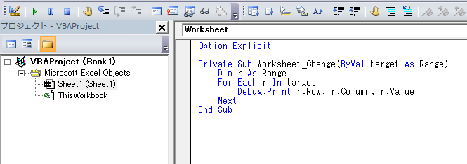

[TOP](.)

# セル変更に合わせてVBAを実行
セルの値を編集したら背景の色を変えるなど 条件付き書式ではできないこともできます。
プログラムを実行させたいシートを表すファイルにプログラムを記述してください




### 例) プログラムを記述したセルの値を変更した時そのセルの行、列番号と値を表示する

```vb
Private Sub Worksheet_Change(ByVal target As Range)
    Dim r as Range
    For Each r in target
	    Debug.Print r.Row, r.Column, r.Value
	Next
End Sub
```
targetに編集したセルが1つもしくは複数設定されます。
